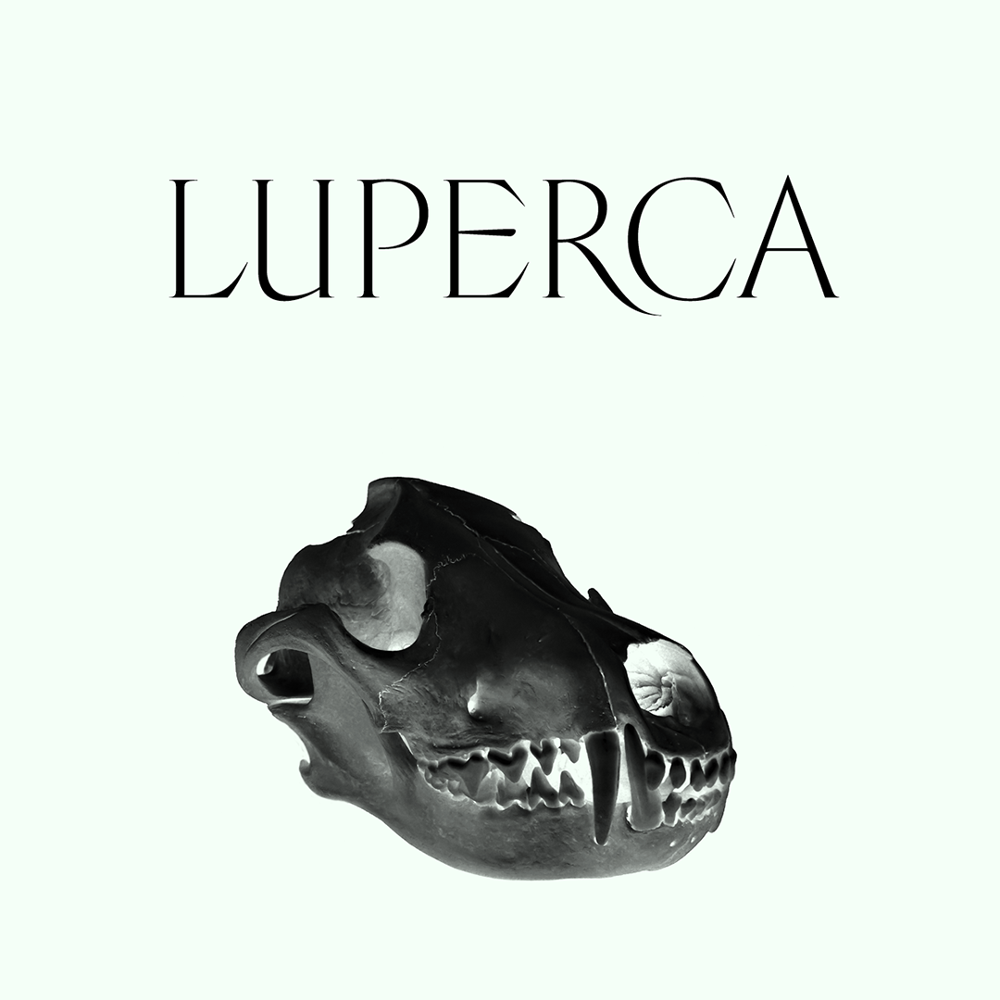
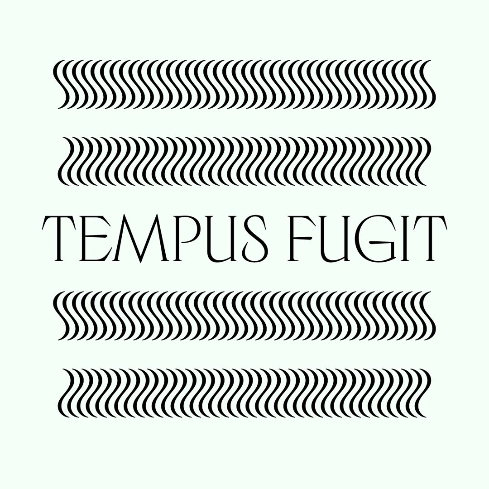
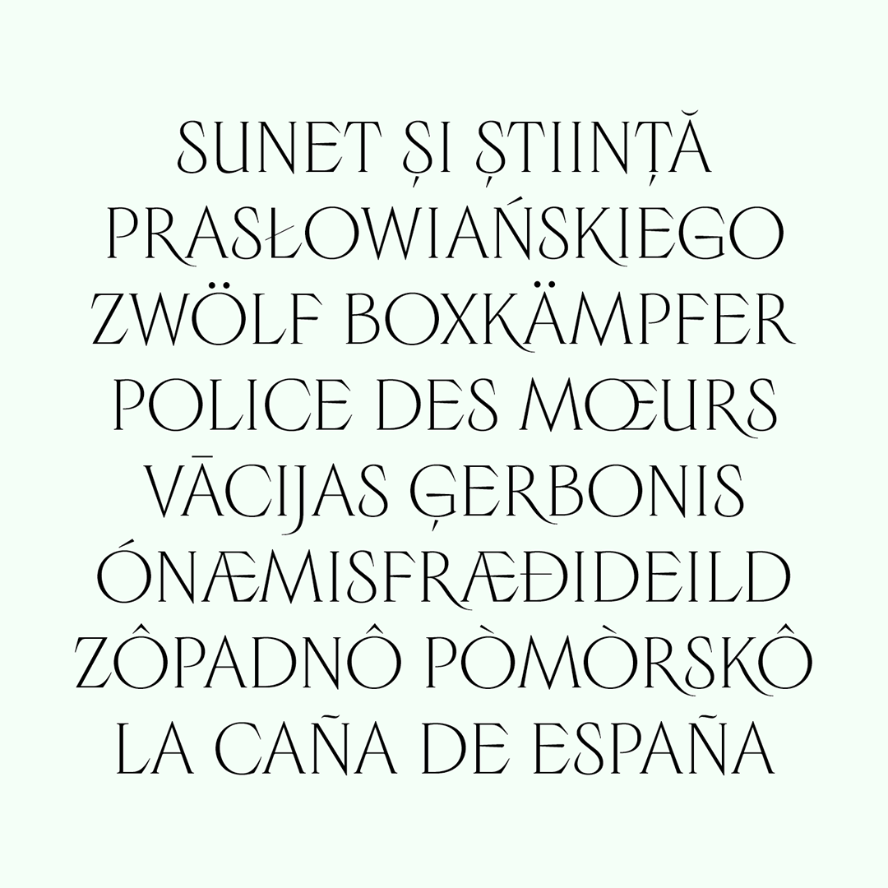
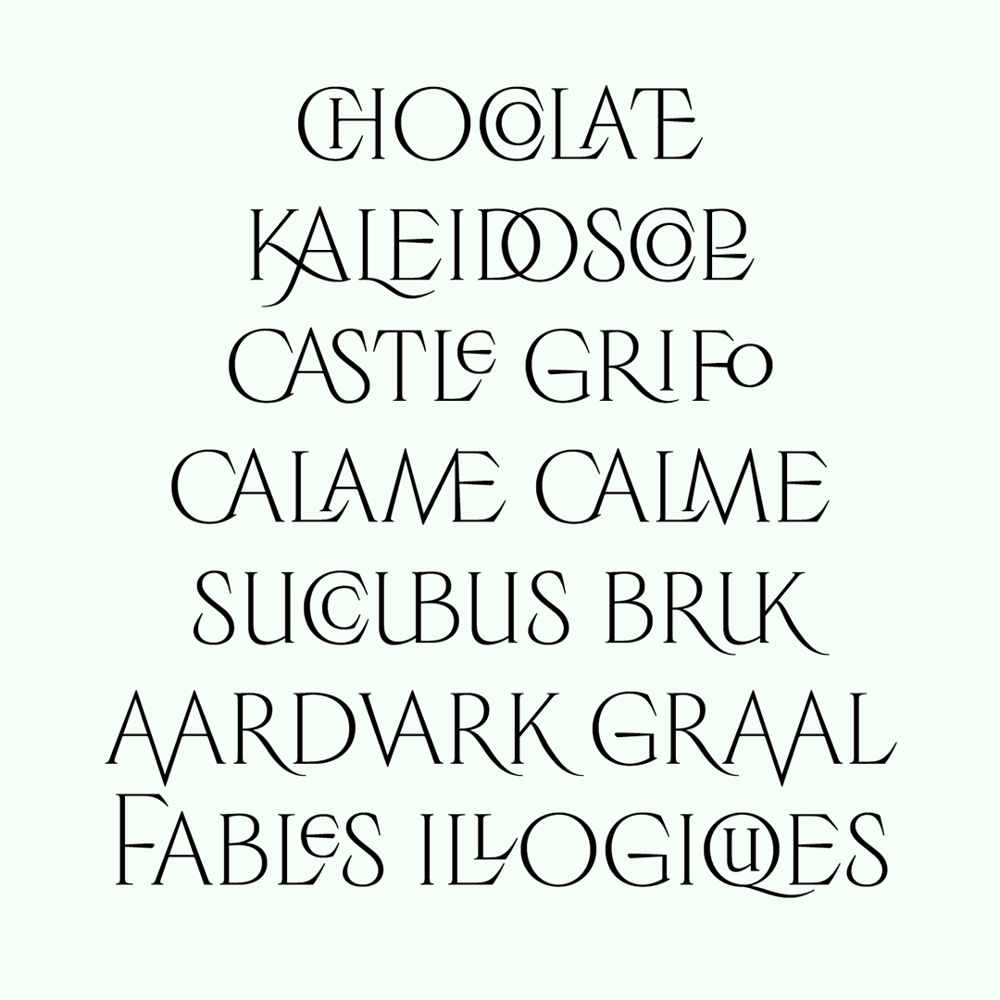
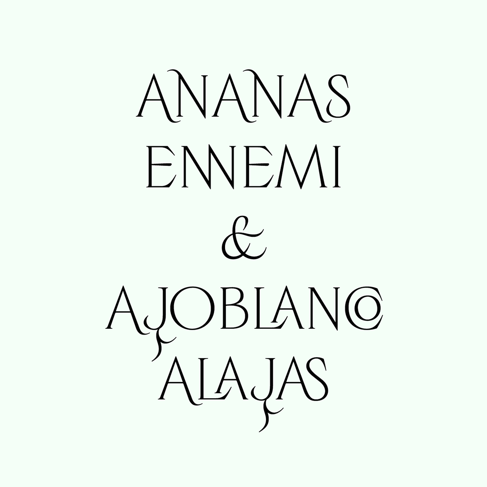
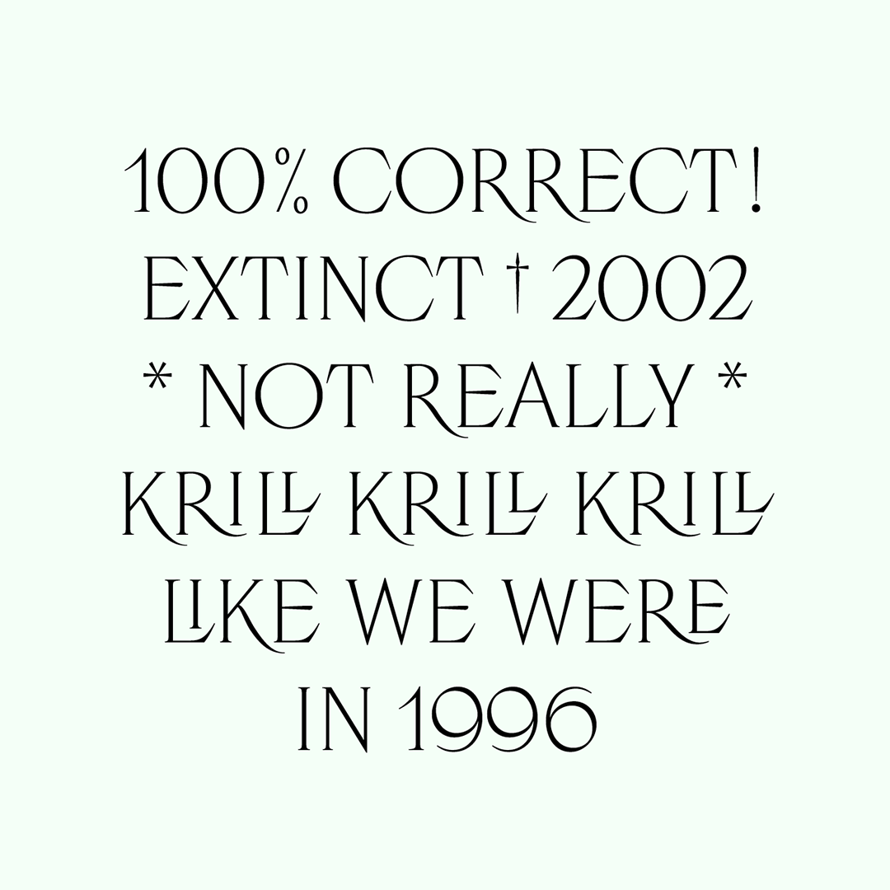

# Luperca

<strong>[EN]</strong>

Luperca is a typeface that explores a possible evolution of Roman square capitals.  It was originally designed for the 11th issue of [Cercle magazine](https://www.cerclemagazine.com/), which was dedicated to mythology.

On the one hand, it collects epigraphic Latin shapes that were used to save space (ligatures, capitals that are higher than the cap height or lower than the baseline to create nested shapes) and represents them in a digital format. In the context of a typeface dedicated to an editorial use, this graphic devices allow to compose titles that are more compact, in order to better compensate to the rather wide length of its letters.

On the other hand, it gathers a set of graphical structures that belong to different time periods and adds to them contemporary calligraphic details. For instance, the tail of the letter Q is inspired by the Lyon Tablet, and it confers the texture of the text a particular rythm. Other letters have serif which are inspired by the way the square capitals were engraved with a chisel. However, the bar of the letter E is based on the rotation of a calligraphic pen. In each part of this project the balance between calligraphy and typography, between drawn letter and engraved letter, has been considered. Luperca contains five optical display sizes.

Luperca has been created by Ariel Martín Pérez (www.tainome.com - contact@tainome.com) and released under the SIL Open Font Licence 1.1 in 2025. Luperca is distributed by Tunera Type Foundry (www.tunera.xyz).

To know how to use this typeface, please read the FAQ (http://www.tunera.xyz/faq/)

<strong>[FR]</strong>

Luperca est une fonte typographique qui explore un possible évolution pour la capitale monumentale. Elle a été dessinée pour le numéro 11 du [magazine Cercle](https://www.cerclemagazine.com/), dédié à la mythologie.

D’une part, elle récupère des formes épigraphiques latines employées pour gagner de la place (ligatures, capitales qui dépassent la hauteur ou la ligne de base des autres pour créer des imbrications de lettres) et les restitue dans un format numérique. Au sein d’un projet de caractère typographique destiné à une utilisation éditoriale, ces dispositifs graphiques permettent de composer des titres plus compacts, pour compenser la largeur relativement étendue de ses lettres. 

D’autre part, elle réunit un ensemble de structures graphiques appartenant à différentes périodes historiques et apporte des détails calligraphiques contemporains. Par exemple, la queue de la lettre Q est inspirée par la Table Claudienne de Lyon, ce qui confère au gris de texte un rythme particulier. D’autres caractères doivent leur terminaisons à la manière dont les capitales monumentales étaient gravées avec un burin. Par contre, la barre du E est basée sur une rotation d'une plume calligraphique. Dans chaque étape de ce projet l'équilibre entre calligraphie et typographie, et entre lettre dessinée et lettre incise, a été considéré. Luperca présente cinq corps optiques d'affichage.

Luperca a été créée par Ariel Martín Pérez (www.tainome.com - contact@tainome.com) et publié sous la licence SIL Open Font License 1.1 en 2025. Luperca est distribuée par Tunera Type Foundry (www.tunera.xyz).

Pour savoir comment utiliser cette fonte, veuillez lire la FAQ (http://www.tunera.xyz/faq-2/)

<strong>[ES]</strong>

Luperca es un tipo de letra que explora una posible evolución de la mayúscula monumental romana. Ha sido diseñada para el número 11 de la [revista Cercle](https://www.cerclemagazine.com/), dedicado a la mitología.

Por un lado, recupera formas epigráficas latinas empleadas para ahorrar espacio (ligaduras, capitales que sobrepasan la altura o la línea de base de las demás para crear imbricaciones de letras) y las restituye en un formato digital. En el contexto de un proyecto de tipo de letra destinado a un uso editorial, estos dispositivos gráficos permiten componer títulos más compactos, para compensar la anchura relativamente extensa de sus letras.

Por otro lado, reúne un conjunto de estructuras gráficas pertenecientes a diferentes periodos históricos y aporta detalles caligráficos contemporáneos. Por ejemplo, la cola descendente de la letra Q está inspirada por la Tabla claudiana de Lyon, lo cual da al gris tipográfico un ritmo particular. Otras letras deben sus remates a la manera de la cual las mayúsculas monumentales estaban grabadas con un cinzel. Sin embargo, la barra de la letra E está basada en una rotación de la pluma caligráfica. En cada parte de este proyecto el equilibrio entre la caligrafía y la tipografía, entre la letra dibujada y la letra incisa, ha sido considerado. Luperca presenta cinco tamaños ópticos.

Luperca ha sido creado por Ariel Martín Pérez (www.tainome.com - contact@tainome.com) y publicado bajo la licencia SIL Open Font License 1.1 en 2025. Luperca es distribuido por Tunera Type Foundry (www.tunera.xyz).

Para saber cómo usar este tipo de letra, lea las preguntas frecuentes (http://www.tunera.xyz/preguntas-frecuentes/)

## Specimen

## License

Luperca is licensed under the SIL Open Font License, Version 1.1.
This license is copied below, and is also available with a FAQ at
http://scripts.sil.org/OFL

## Repository Layout

This font repository follows the Unified Font Repository v2.0,
a standard way to organize font project source files. Learn more at
https://github.com/unified-font-repository/Unified-Font-Repository
